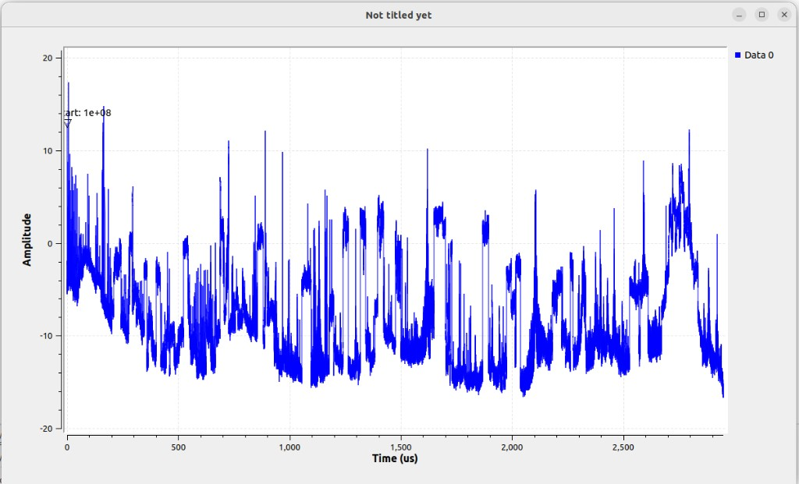
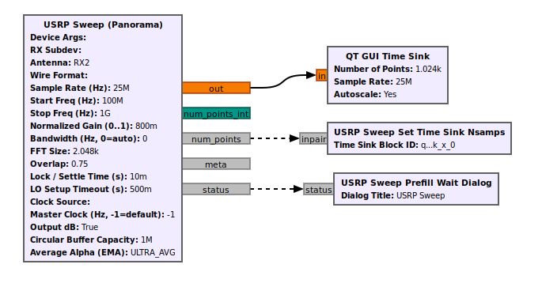
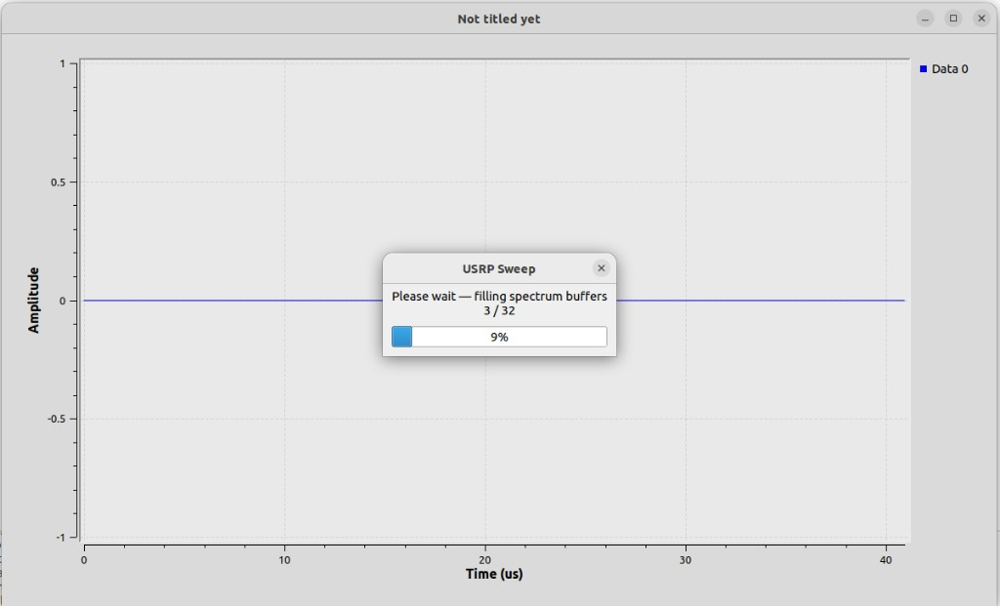
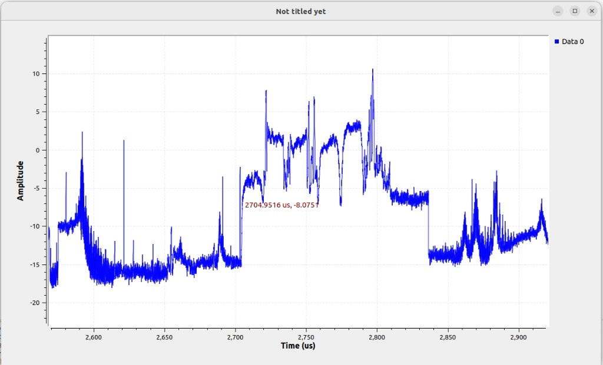
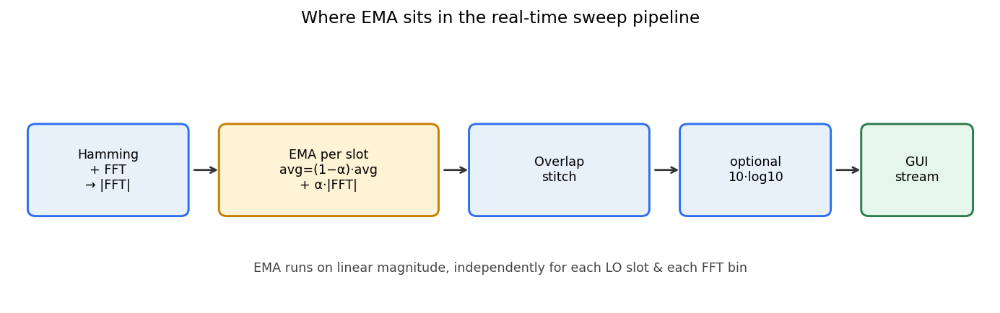
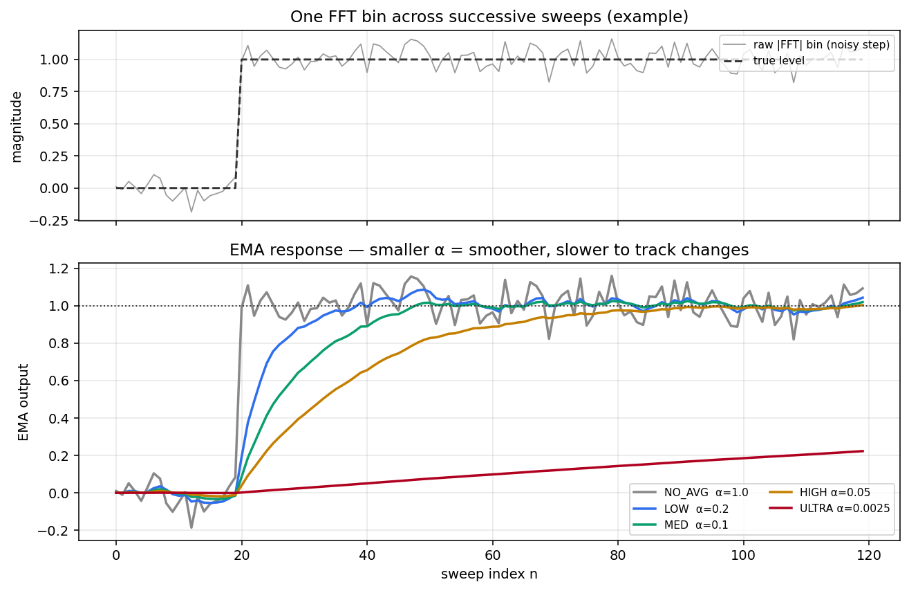
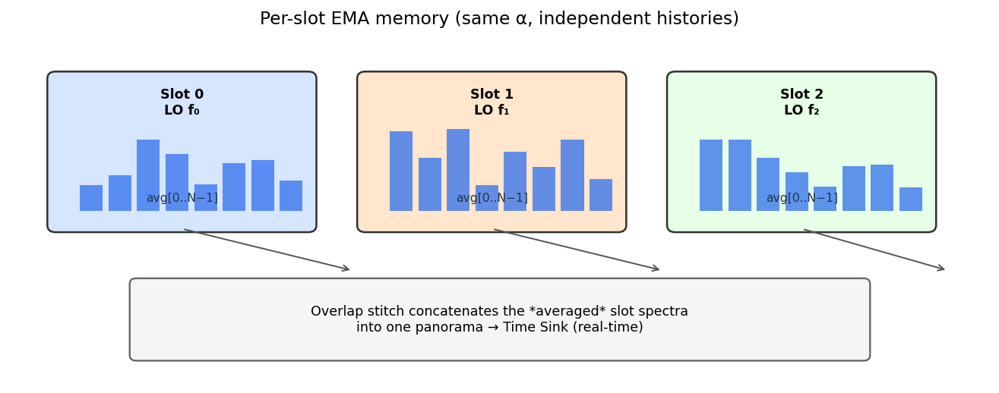

# gr-usrp_sweep

**Real-time USRP panorama / frequency-sweep spectrum source for GNU Radio**

GNU Radio Out-of-Tree (OOT) module that turns any UHD-compatible USRP into a
**live wideband spectrum sweeper**: retune → settle → capture → Hamming FFT →
overlap stitch → optional EMA averaging → float stream tagged with `sweep_start`.

Works over **USB** (B200 / B200mini / B210, …) and **Ethernet** (N200 / N210 /
X310 / …) through the same GRC block — only `Device Args` (and rate limits)
change.

<p align="center">
  
</p>

<p align="center"><em>Real-time stitched panorama (100 MHz → 1 GHz) on QT GUI Time Sink</em></p>

---

## Table of contents

1. [Requirements & installation](#requirements--installation)
2. [Quick start (real-time)](#quick-start-real-time)
3. [Supported USRP hardware](#supported-usrp-hardware)
4. [How the real-time pipeline works](#how-the-real-time-pipeline-works)
5. [Overlap — what it is and how it is applied](#overlap--what-it-is-and-how-it-is-applied)
6. [Averaging (EMA) algorithm](#averaging-ema-algorithm)
7. [GRC parameters](#grc-parameters)
8. [Build from source](#build-from-source)
9. [Repository layout](#repository-layout)
10. [License](#license)

---

## Requirements & installation

Install these **before** building this OOT.

### 1) USB (for B200-family devices)

```bash
# USB rules so non-root can open the device
sudo apt-get update
sudo apt-get install -y udev
# UHD ships udev rules; after installing UHD:
sudo cp /usr/lib/uhd/utils/uhd-usrp.rules /etc/udev/rules.d/   # path may vary
sudo udevadm control --reload-rules
sudo udevadm trigger
```

Plug the USRP USB cable into a **USB 3.0** port when possible (B200mini on USB2 is limited).

### 2) UHD (Ettus driver — USB **and** Ethernet)

```bash
sudo apt-get install -y \
  libuhd-dev uhd-host \
  python3-uhd
```

Verify the radio is visible:

```bash
# USB example
uhd_find_devices

# Ethernet example (set your IP)
uhd_find_devices --args="addr=192.168.10.2"
uhd_usrp_probe --args="addr=192.168.10.2"
```

> **Network tip (N200 / X310):** host and USRP must be on the same subnet.
> For high sample rates, raise the UDP receive buffer if UHD warns about it:
> `sudo sysctl -w net.core.rmem_max=50000000`

### 3) GNU Radio (≥ 3.10) + FFTW

```bash
sudo apt-get install -y \
  gnuradio gnuradio-dev \
  libfftw3-dev \
  cmake g++ pkg-config \
  pybind11-dev python3-pybind11
```

### 4) Optional — ARM hosts (Raspberry Pi / Jetson / …)

Same packages via `apt` on Debian/Ubuntu ARM64. Prefer a **lighter FFT size**
(e.g. 1024) and modest sample rate so the CPU keeps up with real-time hops.

```bash
uname -m   # aarch64 / armv7l
sudo apt-get install -y gnuradio-dev libuhd-dev libfftw3-dev cmake g++
```

---

## Quick start (real-time)

```bash
git clone https://github.com/haghpanah/gr_sweep_usrp.git
cd gr_sweep_usrp
mkdir -p build && cd build
cmake .. -DCMAKE_INSTALL_PREFIX="$HOME/.local"
make -j"$(nproc)"
make install
```

Launch GRC with this tree preferred (no stale installs):

```bash
cd /path/to/gr_sweep_usrp
./run_gnuradio_companion.sh
```

Open the example flowgraph:

`examples/flowgraphs/usrp_sweep_demo.grc`

<p align="center">
  
</p>

**Minimum wiring for a stationary real-time display**

| From | To | Purpose |
|------|----|---------|
| `out` | QT GUI Time Sink | Spectrum bins (dB or linear) |
| `num_points` | **USRP Sweep Set Time Sink Nsamps** | Sets Time Sink length = sweep size |
| `status` | **USRP Sweep Prefill Wait Dialog** | Wait UI while buffers fill |

Time Sink settings:

- **Trigger Mode** = Tag  
- **Trigger Tag Key** = `sweep_start`  
- Initial *Number of Points* can stay at 1024 (helper updates it)

On start you will see a short **prefill** wait (circular buffer fills completely),
then the live panorama updates continuously:

<p align="center">
  
</p>

<p align="center">
  
</p>

---

## Supported USRP hardware

This block talks to UHD only — **any USRP UHD can open** is supported.

| Transport | Examples | Typical `Device Args` | Notes |
|-----------|----------|----------------------|--------|
| **USB** | B200, B200mini, B210 | `type=b200` or empty if only one device | Prefer USB3; high rates OK |
| **Ethernet** | N200, N210 | `addr=192.168.10.2` | Keep rate ≤ ~25 Msps on 1 GbE |
| **Ethernet / 10 GbE** | X310, N3xx | `type=x300,addr=192.168.40.2` | Use **RX Subdev** `A:0` or `B:0` (single channel today) |

The block is **single-RX-channel** (UHD channel 0). On dual-radio X310, pick the
physical radio with `RX Subdev` (`A:0` / `B:0`).

After `set_rx_rate`, the OOT **reads the actual hardware rate** and rebuilds
sweep geometry. That is required on N200/USRP2 where e.g. 40 Msps may coerce to
33.⅓ Msps.

**Antenna** combo in GRC: `RX2` | `TX/RX` (matched case-insensitively to UHD).

---

## How the real-time pipeline works

Designed for **continuous live display**, not offline recordings.

```text
┌─────────────┐   retune LO    ┌──────────────┐   sc16 IQ    ┌─────────────┐
│  USRP (UHD) │ ─────────────► │ settle+recv  │ ───────────► │ Hamming+FFT │
└─────────────┘   per slot     └──────────────┘              └──────┬──────┘
                                                                    │ |FFT|
                                                                    ▼
┌─────────────┐   float bins   ┌──────────────┐   EMA α     ┌─────────────┐
│ Time Sink   │ ◄───────────── │ circ. buffer │ ◄────────── │ overlap     │
│ (tag trig.) │   +sweep_start │  (prefill)   │   stitch    │ stitch      │
└─────────────┘                └──────────────┘             └─────────────┘
        ▲
        │ num_points message → set_nsamps(N)
```

1. **Acquisition thread** hops the LO across `[start_fc, stop_fc]`.
2. Each hop: wait `lo_locked` → settle `lock_time` → discard short burst → capture `fft_size` samples.
3. Per slot: Hamming window → FFTW → fftshift → magnitude.
4. Optional **EMA** on linear magnitude (see below).
5. **Overlap stitch** builds one panorama vector of length
   `compute_sweep_size(start, stop, rate, fft_size)`.
6. Push into a **circular buffer**; GUI waits until the buffer is **full** (prefill).
7. `work()` streams the **latest** sweep with a `sweep_start` stream tag (value = start frequency).

There is **no artificial inter-frame sleep** — update rate is limited only by
LO hop + capture time. That is what makes the display feel real-time even on
wide spans (e.g. 100 MHz–1 GHz).

Qt → OOT mapping:

| Qt Oscilloscope | This OOT |
|-----------------|----------|
| `Panorama_Params` | GRC / `usrp_sweep.make(...)` |
| `UHD_Timed_TxRx::panorama` | Acquisition thread |
| `panorama_receiver` | `receive_slot()` |
| `Panorama_FFT` | `compute_slot_spectrum()` |
| `pano_FFT_average_alpha` | `average_alpha` EMA |
| `panorama_plots` stitch | `stitch_slots()` |

---

## Overlap — what it is and how it is applied

### Why overlap exists

Each LO tune only sees ≈ one sample-rate of RF bandwidth. To cover a span wider
than `sample_rate`, the radio must **hop**. Neighbouring FFT frames share an
edge band so the stitch has no gaps / discontinuities.

```text
Frequency axis →

Slot 0 coverage:   |████████████████████|
Slot 1 coverage:            |████████████████████|
Slot 2 coverage:                     |████████████████████|
                            ◄─ overlap ─►
```

### Definitions used in code

```text
freq_step   = sample_rate * (1 - overlap)
num_slots   = ceil( (stop - start - rate) / freq_step ) + 1     (when span > rate)
sweep_size  = ceil( (fft_size / sample_rate) * (stop - start) )
```

GRC combo values: **`0` · `0.25` · `0.5` · `0.75` · `1`**  
(`1` is clamped internally to `0.999` so the hop step never becomes zero.)

| Overlap | Behaviour |
|---------|-----------|
| `0` | Fastest: abutting slots, fewest hops |
| `0.25` | Classic Qt default — good balance |
| `0.5` / `0.75` | Smoother edges, more hops, slower update |
| `1` (~0.999) | Maximum overlap — slowest, densest |

### How stitch uses overlap

For FFT length `N` and overlap `α`:

```text
overlap_bins = N * α / 2

Slot 0:   keep bins [0 , N - overlap_bins)
Slot k:   keep bins [overlap_bins , N - overlap_bins)
Last:     keep enough bins to fill sweep_size
```

Those kept segments are concatenated into one panorama of length `sweep_size`.
Optional `10·log10(|·|)` is applied **after** stitch selection (per kept bin)
when **Output dB** is enabled.

```text
Per-slot |FFT| (length N)
   │
   ├─ drop left overlap region (except first slot)
   ├─ drop right overlap region (except last slot)
   └─ append into panorama[0 .. sweep_size)
```

Higher overlap ⇒ more discarded edge bins per slot ⇒ need more slots to cover
the same span ⇒ **slower** real-time refresh, but gentler seams.

---

## Averaging (EMA) algorithm

This OOT uses the same **exponential moving average (EMA)** as the Qt panorama
(`pano_FFT_average_alpha`). The goal is to keep a **real-time** display while
suppressing frame-to-frame noise — without waiting for a long block average.

### Why average at all?

Each sweep produces a fresh noisy `|FFT|` for every LO slot. Without averaging,
the Time Sink flickers. A classical “average last *M* sweeps” needs a large
buffer and reacts in steps. EMA needs **one previous vector per slot** and
updates every sweep with a single blend factor **α**.

### Where it runs in the pipeline

EMA is applied **after** the Hamming FFT magnitude and **before** overlap
stitch / optional dB conversion — on **linear** `|FFT|`, independently for
**each LO slot** and **each FFT bin**.

<p align="center">
  
</p>


### Update equation

For sweep index \(n\), slot \(s\), bin \(k\):

\[
\mathrm{avg}_{s,k}[n]
=
(1-\alpha)\,\mathrm{avg}_{s,k}[n-1]
+
\alpha\,|\mathrm{FFT}|_{s,k}[n]
\]

Then the averaged value **replaces** the slot spectrum used for stitching:

\[
|\mathrm{FFT}|_{s,k}[n] \;\leftarrow\; \mathrm{avg}_{s,k}[n]
\]

Special case **`α = 1` (NO_AVG)**: no memory — output equals the current frame.

```text
weight on history     weight on new frame
        │                     │
        ▼                     ▼
  avg ← (1 − α) · avg  +  α · |FFT|_new
```

| α close to… | Meaning |
|-------------|---------|
| **1** | Almost only the new frame (fast, noisy) |
| **0** | Almost only history (slow, very smooth) |

Rough rule of thumb: after a sudden level change, the output reaches ~63 % of
the new value in about **\(1/\alpha\)** sweeps (and ~95 % in ~ \(3/\alpha\)).

| Mode | α | ≈ sweeps to ~63 % | ≈ sweeps to ~95 % |
|------|---|-------------------|-------------------|
| NO_AVG | 1.0 | 1 | 1 |
| LOW_AVG | 0.2 | ~5 | ~14 |
| MEDIUM_AVG | 0.1 | ~10 | ~30 |
| HIGH_AVG | 0.05 | ~20 | ~60 |
| ULTRA_AVG | 0.0025 | ~400 | ~1200 |

### Visual: how α shapes the real-time response

The plot below shows one FFT bin when a tone (step) appears amid noise.
Smaller α tracks more slowly but rejects noise better — still updating
**every** real-time sweep.

<p align="center">
  
</p>

### Per-slot memory (important for panorama)

A wideband sweep is many LO hops. Slot 0 (e.g. low band) and slot 7 (higher
band) must **not** share one average — each slot keeps its own length-`fft_size`
vector `avg[0 … N−1]`.

<p align="center">
  
</p>

```text
Sweep n:
  Slot 0:  mag0 ──EMA──► avg0  ─┐
  Slot 1:  mag1 ──EMA──► avg1  ─┼─ overlap stitch ─► panorama[n]
  Slot 2:  mag2 ──EMA──► avg2  ─┘

Sweep n+1: same slot buffers are updated again (history lives across sweeps).
```

### Pseudocode (matches `apply_slot_average_locked`)

```text
for each bin k in 0 .. fft_size-1:
    if α >= 1:
        avg[slot][k] = mag[k]          # NO_AVG
    else:
        avg[slot][k] = avg[slot][k]*(1-α) + mag[k]*α
        mag[k]       = avg[slot][k]    # feed stitch with averaged spectrum
```

### GRC combo values

| Label | α | Typical use |
|-------|---|-------------|
| **NO_AVG** | `1.0` | Debug / fastest reaction |
| **LOW_AVG** | `0.2` | Light smoothing, still snappy |
| **MEDIUM_AVG** | `0.1` | General spectrum monitoring |
| **HIGH_AVG** | `0.05` | Quiet noise floor |
| **ULTRA_AVG** | `0.0025` | Very stable floor (slow to show new signals) |

### Reset behaviour

The per-slot `avg` buffers are **cleared** when:

- FFT size / number of slots changes (geometry reconfigure), or  
- you change **Average Alpha** in GRC (`set_average_alpha`).

After a reset, averages start from 0 and “warm up” over roughly \(1/\alpha\)
sweeps (same idea as the original Qt UI).

### Design notes

- Averaging on **linear** magnitude (then optional dB) matches the Qt path and
  avoids biasing the mean of log-power.
- EMA is cheap: \(O(N)\) per slot, one buffer of size `num_slots × fft_size`.
- Real-time property is preserved: every completed sweep still updates the GUI;
  α only changes **how much** history mixes into that update.

---

## GRC parameters

| Parameter | Meaning |
|-----------|---------|
| Device Args | UHD args (`type=b200`, `addr=…`, …) |
| RX Subdev | e.g. `A:0` / `B:0` on X310 |
| Antenna | `RX2` / `TX/RX` |
| Sample Rate | Requested rate (actual rate is adopted after UHD coerce) |
| Start / Stop Freq | Sweep span (Hz) |
| Normalized Gain | `(0, 1]` |
| FFT Size | Samples & FFT length per slot |
| Overlap | Combo `0…1` |
| Lock / Settle Time | Sleep after LO lock before capture |
| Output dB | `10*log10` on stitched bins |
| Circular Buffer Capacity | Prefill depth (clamped to max 32) |
| Average Alpha | EMA combo (NO…ULTRA) |

Helper blocks:

- **USRP Sweep Set Time Sink Nsamps** — applies `num_points` to the Time Sink  
- **USRP Sweep Prefill Wait Dialog** — English wait UI during buffer fill  

---

## Build from source

```bash
cmake -S . -B build -DCMAKE_INSTALL_PREFIX="$HOME/.local"
cmake --build build -j"$(nproc)"
cmake --install build
```

Environment (also set by `./run_gnuradio_companion.sh` / `./run_flowgraph.sh`):

```bash
export PYTHONPATH="$HOME/.local/lib/python3/dist-packages:$PYTHONPATH"
export LD_LIBRARY_PATH="$HOME/.local/lib:$LD_LIBRARY_PATH"
export GRC_BLOCKS_PATH="$HOME/.local/share/gnuradio/grc/blocks:$GRC_BLOCKS_PATH"
```

Python helpers:

```python
from gnuradio import usrp_sweep
N = usrp_sweep.compute_sweep_size(100e6, 1e9, 25e6, 2048)
S = usrp_sweep.compute_num_slots(100e6, 1e9, 25e6, 0.25)
```

---

## Repository layout

```text
gr_sweep_usrp/
├── README.md                 ← you are here
├── MANIFEST.md               ← GNU Radio package metadata
├── CMakeLists.txt
├── run_gnuradio_companion.sh ← preferred GRC launcher
├── run_flowgraph.sh
├── install_local_lib.sh
├── include/gnuradio/usrp_sweep/   public C++ API
├── lib/                           usrp_sweep_impl + circular buffer
├── grc/                           GRC YAML block definitions
├── python/usrp_sweep/             bindings + helper blocks
├── examples/flowgraphs/           demo .grc / .py
├── docs/images/                   README screenshots
└── tools/                         optional debug utilities
```

---

## License

GPL-3.0-or-later — see package headers / `MANIFEST.md`.

**Author:** Mohammad Haghpanah
